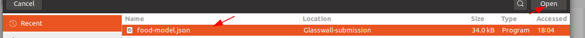
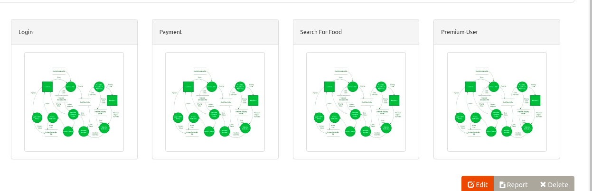
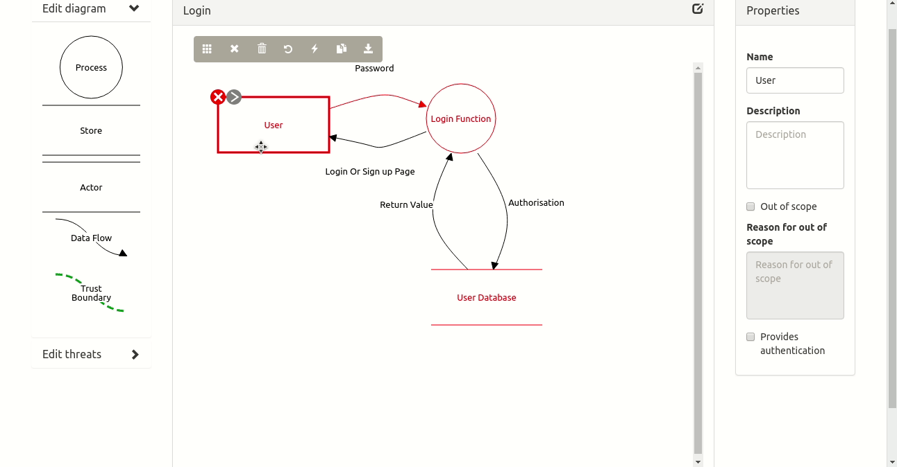

## Threat Dragon

Download and Install the Latest version of the Threat Dragon from the [official-github](https://github.com/mike-goodwin/owasp-threat-dragon-desktop/releases)

Download the `json` file 

[threat-model-json](food-model.json) 

Now open the Installed Owasp Threat Dragon application and click `open` from the menu bar and Select the Downloaded file and click open

Click any one of the `DFD diagram` 

To see the threat element associated with each element  with the mitigation Click the element and Select `Edit threats`

THe Full PDF report can be found here

[Report](food-model.pdf)